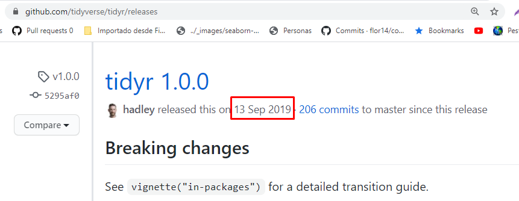

```{r setup, include=FALSE}
options(htmltools.dir.version = FALSE, echo = FALSE)
```

```{r xaringan-themer, include=FALSE, warning=FALSE}
library(xaringanthemer)
style_duo_accent(
  primary_color = "#01CC99",
  secondary_color = "#C3EBE2",
  inverse_header_color = "#2E414D", 
  code_inline_color = "#179c55",
    code_font_family = "GlacialIndifferenceRegular",
  code_font_url = "https://fontlibrary.org/face/glacial-indifference",
  text_font_family = "GlacialIndifferenceRegular",
  text_font_size = "25px",
  text_font_url = "https://fontlibrary.org/face/glacial-indifference",
  header_font_family = "Sifonn",
  header_font_url = "https://fonts.cdnfonts.com/css/sifonn",
)

```
---

# Hello! 👋

Here I would like to share with you this code I am working on. Let me know if you have any problems.

[![badge](https://img.shields.io/badge/run-binder-E66581.svg?logo=data:image/png;base64,iVBORw0KGgoAAAANSUhEUgAAAFkAAABZCAMAAABi1XidAAAB8lBMVEX///9XmsrmZYH1olJXmsr1olJXmsrmZYH1olJXmsr1olJXmsrmZYH1olL1olJXmsr1olJXmsrmZYH1olL1olJXmsrmZYH1olJXmsr1olL1olJXmsrmZYH1olL1olJXmsrmZYH1olL1olL0nFf1olJXmsrmZYH1olJXmsq8dZb1olJXmsrmZYH1olJXmspXmspXmsr1olL1olJXmsrmZYH1olJXmsr1olL1olJXmsrmZYH1olL1olLeaIVXmsrmZYH1olL1olL1olJXmsrmZYH1olLna31Xmsr1olJXmsr1olJXmsrmZYH1olLqoVr1olJXmsr1olJXmsrmZYH1olL1olKkfaPobXvviGabgadXmsqThKuofKHmZ4Dobnr1olJXmsr1olJXmspXmsr1olJXmsrfZ4TuhWn1olL1olJXmsqBi7X1olJXmspZmslbmMhbmsdemsVfl8ZgmsNim8Jpk8F0m7R4m7F5nLB6jbh7jbiDirOEibOGnKaMhq+PnaCVg6qWg6qegKaff6WhnpKofKGtnomxeZy3noG6dZi+n3vCcpPDcpPGn3bLb4/Mb47UbIrVa4rYoGjdaIbeaIXhoWHmZYHobXvpcHjqdHXreHLroVrsfG/uhGnuh2bwj2Hxk17yl1vzmljzm1j0nlX1olL3AJXWAAAAbXRSTlMAEBAQHx8gICAuLjAwMDw9PUBAQEpQUFBXV1hgYGBkcHBwcXl8gICAgoiIkJCQlJicnJ2goKCmqK+wsLC4usDAwMjP0NDQ1NbW3Nzg4ODi5+3v8PDw8/T09PX29vb39/f5+fr7+/z8/Pz9/v7+zczCxgAABC5JREFUeAHN1ul3k0UUBvCb1CTVpmpaitAGSLSpSuKCLWpbTKNJFGlcSMAFF63iUmRccNG6gLbuxkXU66JAUef/9LSpmXnyLr3T5AO/rzl5zj137p136BISy44fKJXuGN/d19PUfYeO67Znqtf2KH33Id1psXoFdW30sPZ1sMvs2D060AHqws4FHeJojLZqnw53cmfvg+XR8mC0OEjuxrXEkX5ydeVJLVIlV0e10PXk5k7dYeHu7Cj1j+49uKg7uLU61tGLw1lq27ugQYlclHC4bgv7VQ+TAyj5Zc/UjsPvs1sd5cWryWObtvWT2EPa4rtnWW3JkpjggEpbOsPr7F7EyNewtpBIslA7p43HCsnwooXTEc3UmPmCNn5lrqTJxy6nRmcavGZVt/3Da2pD5NHvsOHJCrdc1G2r3DITpU7yic7w/7Rxnjc0kt5GC4djiv2Sz3Fb2iEZg41/ddsFDoyuYrIkmFehz0HR2thPgQqMyQYb2OtB0WxsZ3BeG3+wpRb1vzl2UYBog8FfGhttFKjtAclnZYrRo9ryG9uG/FZQU4AEg8ZE9LjGMzTmqKXPLnlWVnIlQQTvxJf8ip7VgjZjyVPrjw1te5otM7RmP7xm+sK2Gv9I8Gi++BRbEkR9EBw8zRUcKxwp73xkaLiqQb+kGduJTNHG72zcW9LoJgqQxpP3/Tj//c3yB0tqzaml05/+orHLksVO+95kX7/7qgJvnjlrfr2Ggsyx0eoy9uPzN5SPd86aXggOsEKW2Prz7du3VID3/tzs/sSRs2w7ovVHKtjrX2pd7ZMlTxAYfBAL9jiDwfLkq55Tm7ifhMlTGPyCAs7RFRhn47JnlcB9RM5T97ASuZXIcVNuUDIndpDbdsfrqsOppeXl5Y+XVKdjFCTh+zGaVuj0d9zy05PPK3QzBamxdwtTCrzyg/2Rvf2EstUjordGwa/kx9mSJLr8mLLtCW8HHGJc2R5hS219IiF6PnTusOqcMl57gm0Z8kanKMAQg0qSyuZfn7zItsbGyO9QlnxY0eCuD1XL2ys/MsrQhltE7Ug0uFOzufJFE2PxBo/YAx8XPPdDwWN0MrDRYIZF0mSMKCNHgaIVFoBbNoLJ7tEQDKxGF0kcLQimojCZopv0OkNOyWCCg9XMVAi7ARJzQdM2QUh0gmBozjc3Skg6dSBRqDGYSUOu66Zg+I2fNZs/M3/f/Grl/XnyF1Gw3VKCez0PN5IUfFLqvgUN4C0qNqYs5YhPL+aVZYDE4IpUk57oSFnJm4FyCqqOE0jhY2SMyLFoo56zyo6becOS5UVDdj7Vih0zp+tcMhwRpBeLyqtIjlJKAIZSbI8SGSF3k0pA3mR5tHuwPFoa7N7reoq2bqCsAk1HqCu5uvI1n6JuRXI+S1Mco54YmYTwcn6Aeic+kssXi8XpXC4V3t7/ADuTNKaQJdScAAAAAElFTkSuQmCC)](https://mybinder.org/v2/gh/flor14/reproducibilidad_meetup/master?urlpath=rstudio)

--

**Issue 1**

Absolute path 

--

**Issue 2**

Package version of `tidyr 0.8.3` does not include `pivot_longer()` and `pivot_wider()` functions added in `tidyr version 1.0.0`

Use `sessionInfo()` to check this

---

class: inverse, center, middle

# Would I have reproducible work only sharing the code and the data?

---

class: middle

> ####  "Packages, libraries, and specific versions of software is crucial information for reproducibility." 

.footnote[[Nuest (2020)](http://www.dlib.org/dlib/january17/nuest/01nuest.html)]

---

class: center, middle, inverse

# Reproducible environments 


---

## There are several tools to capture computational environments

**Capture only the software and its versions used in an environment**

* Package management systems (📦`packrat` -📦 `renv`)

* Binder

**replicate an entire computational environment including the operating system and customised settings**

* Virtual machines 

* Containers

.footnote[[The Turing Way](https://www.turing.ac.uk/research/research-projects/turing-way-handbook-reproducible-data-science)]

---

class: center

# Package management systems

**`renv` package**

```{r echo = FALSE}
knitr::include_graphics("images/renv.png")
```
.footnote[[Reproducible Environments - RStudio](https://environments.rstudio.com/)]
---

# `renv` package

1. 🏁 `renv::init()` works by creating a new library. A library stores installed packages.

--
2. 📦 Install the packages *

--

3. 📸 `renv::snapshot()` creates a new file in your project titled `renv.lock`. The file contains all the information you need to communicate your project’s dependencies at the moment you call snapshot. 

--
4. 🌱 `renv::restore()` recreates the environment!


.footnote[[* Read more about `renv` here](https://environments.rstudio.com/snapshot.html#pre-requisite-steps)]


---

# Binder

Binder is a service which generates fully-functioning versions of projects from a git repository and serves them on the cloud. These “binderized” projects can be accessed and interacted with by others via a web browser. 


```{r echo = FALSE}
knitr::include_graphics("images/binderlogo.png")
```


---

.pull-left[
## Advantages

- Easy to use

- You can access the infomation with one click

- It is free
]
.pull-right[
## Limitations

- Computational power

- Security/privacy (using `mybinder.org` BinderHub)

- Also no FTP for connecting to some data.
]

---

# What is a BinderHub?


```{r echo = FALSE}
knitr::include_graphics("images/siberia.jpg")
```


.footnote[[The Turing Way - BinderHub](https://the-turing-way.netlify.app/reproducible-research/binderhub.html?highlight=mybinder%20org)]

---

# mybinder.org 

A free, public BinderHub. Because it is public, you should not use it if your project requires personal or confidential information (such as passwords).

```{r echo=FALSE}
knitr::include_graphics("images/mybinder.png")
```


---

## "Binderizing" your project 🌀

1. Specify the computational environment

➕📄 **intall.R** 

➕📄 **runtime.txt** )

--

2. Upload the project files to a publicly available repository hosting service, such as **GitHub / GitLab**

--

3. "Binderize" the project (**mybinder.org**) ⏳ 

--

4. Use the correct URL 🔗

---

# ➕📄 `runtime.txt`

> Specify the R and package versions used

For this you must choose a date where the versions of your packages are captured in MRAN.


**`r-version-<YYYY>-<MM>-<DD>`**

---

# ➕📄 `runtime.txt`


```{r eval=FALSE, include=TRUE}
r-3.6-2020-08-20 #r-version-<YYYY>-<MM>-<DD>
```


---

## ➕📄 `install.R`  

> This file should have listed all of the packages to be installed 

```{r eval=FALSE, include=TRUE}
install.packages("ggplot2")
install.packages("shiny")
```


---

# What is MRAN? 📷

Since September 17th, 2014, the checkpoint server has been taking a daily snapshot 📸 at precisely midnight UTC of the entire CRAN repository and storing it on [Microsoft R Archived Network (MRAN)](https://mran.microsoft.com/documents/rro/reproducibility#reproducibility).  

These snapshots have been available to the R community ever since.


--
> ⚠ Non-CRAN packages, such as those available on GitHub, are not part of the snapshot process.
--

.footnote[[MRAN](https://mran.microsoft.com/)]

---

# `checkpoint` package

⏱  E`checkpoint` packagea llows you to install packages as they existed on CRAN on a specific snapshot date as if you had a CRAN time machine.


```{r eval=FALSE, include=TRUE}
library(checkpoint)
checkpoint("YYYY-MM-DD") 
```


.footnote[[`checkpoint` package](https://mran.microsoft.com/documents/rro/reproducibility#checkpointpkg)]
---

# 2. Upload your code to the repository


```{r}
knitr::include_graphics("repo_entorno.png")
```


---

# 3. "Binderize" your project 🌀

a. Go to https://mybinder.org

--

b. Paste the repository URL 
`https://github.com/<your-username>/<your-repository>`

--

c. Finally, click the `Launch` button. 

---

class: center, middle, inverse

# Patience! This could take a while ⏳


---

# RStudio IDE URL  💻

You should call the binderized project using this template link

`https://mybinder.org/v2/gh/<user>/<repository>/<branch>?urlpath?rstudio`

Example 🔗:
http://mybinder.org/v2/gh/flor14/shiny_reproducibilidad_meetup/master?urlpath=rstudio


.footnote[[Ejemplos en el repositorio de Binder](https://github.com/binder-examples/r)]
---

# Shiny app URL  ✨

You should call the binderized project using this template link

`https://mybinder.org/v2/gh/<user>/<repository>/<branch>?urlpath=shiny/<folder>/`

Example 🔗:
https://mybinder.org/v2/gh/flor14/shiny_reproducibilidad_meetup/master?urlpath=shiny/elipse/


.footnote[[Ejemplos en el repositorio de Binder](https://github.com/binder-examples/r)]

---
class: middle, inverse, center 

# Practice 💪

---

# Going back to the first example

* `tidyr` 1.0.0 * Included` pivot_longer () `and` pivot_wider () `

```{r echo=FALSE}

```

---

# Exercise

Starting from a fork of my repository:

Could you modify the code from the first exercise to make it work?


---

class: inverse

# Links

* [CRAN Task View: Reproducible Research](https://cran.r-project.org/web/views/ReproducibleResearch.html)

* [Reproducibility in Production - Webinar](https://rstudio.com/resources/webinars/reproducibility-in-production/)

* [Proyectos en R - R4DS](https://r4ds.had.co.nz/workflow-projects.html#rstudio-projects)

* [The Turing Way Book](https://the-turing-way.netlify.app/)

* [Reproducible Environments - RStudio](https://environments.rstudio.com/)

* [Time_Travel_R (Webinar) - Sean Lopp](https://rstudio.com/resources/webinars/time-travel-r/)

* [renv: Project Environments with R - RStudio blog](https://blog.rstudio.com/2019/11/06/renv-project-environments-for-r/)

* [Rrtools]()

* [Reproducible Research with R - ROpensci Call](https://ropensci.org/commcalls/2019-07-30/)

* [Putting the R into Reproducible Research - Anna Krystalli](https://annakrystalli.me/talks/r-in-repro-research.html#1)

* [Demo renv package](https://environments.rstudio.com/snapshot.html#watch-a-video-demo-of-snapshot-and-restore-with-renv)

---

class: center, middle, inverse

# ¡Thank you!


Web [florencia.netlify.app](florencia.netlify.app)

Twitter [@cantoflor87](twitter.com/cantoflor_87)


