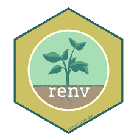
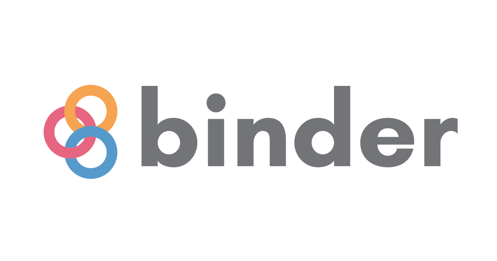
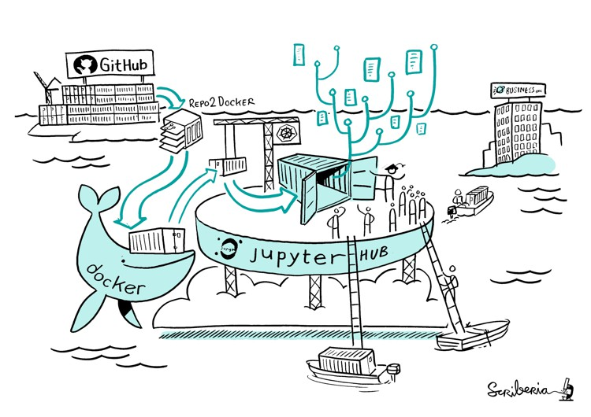
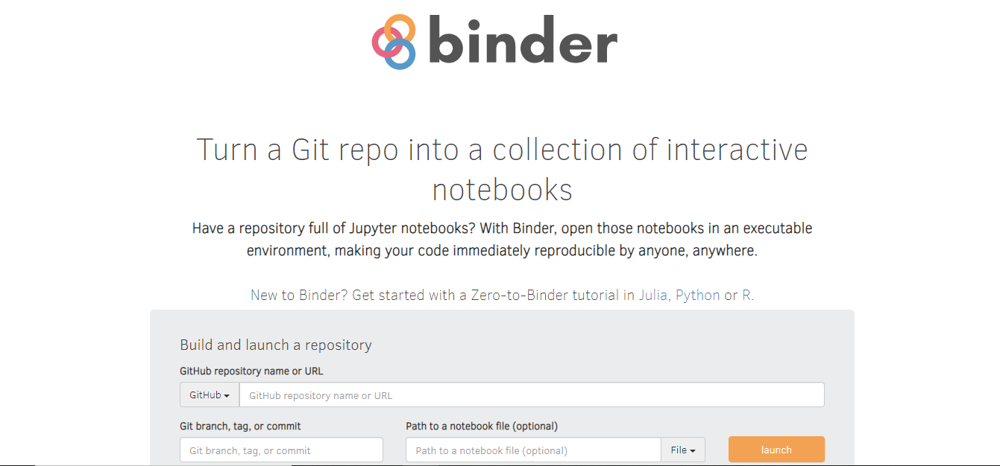
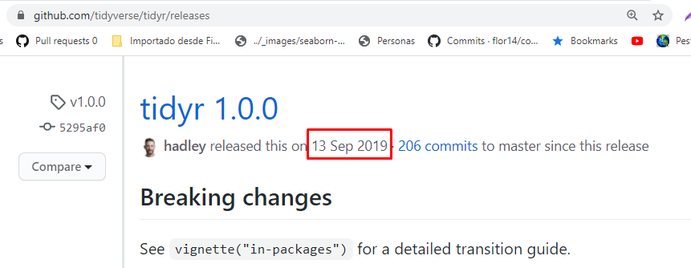

```{r setup, include=FALSE}
options(htmltools.dir.version = FALSE, echo = FALSE)
```

```{r xaringan-themer, include=FALSE, warning=FALSE}
library(xaringanthemer)
style_duo_accent(
  primary_color = "#01CC99",
  secondary_color = "#C3EBE2",
  inverse_header_color = "#2E414D", 
  code_inline_color = "#179c55",
    code_font_family = "GlacialIndifferenceRegular",
  code_font_url = "https://fontlibrary.org/face/glacial-indifference",
  text_font_family = "GlacialIndifferenceRegular",
  text_font_size = "25px",
  text_font_url = "https://fontlibrary.org/face/glacial-indifference",
  header_font_family = "Sifonn",
  header_font_url = "https://fonts.cdnfonts.com/css/sifonn",
)

```
---

# Desafío

Te comparto este código en el que estoy trabajando ¿te funciona?

Abre el proyecto -> [![badge](https://img.shields.io/badge/run-binder-E66581.svg?logo=data:image/png;base64,iVBORw0KGgoAAAANSUhEUgAAAFkAAABZCAMAAABi1XidAAAB8lBMVEX///9XmsrmZYH1olJXmsr1olJXmsrmZYH1olJXmsr1olJXmsrmZYH1olL1olJXmsr1olJXmsrmZYH1olL1olJXmsrmZYH1olJXmsr1olL1olJXmsrmZYH1olL1olJXmsrmZYH1olL1olL0nFf1olJXmsrmZYH1olJXmsq8dZb1olJXmsrmZYH1olJXmspXmspXmsr1olL1olJXmsrmZYH1olJXmsr1olL1olJXmsrmZYH1olL1olLeaIVXmsrmZYH1olL1olL1olJXmsrmZYH1olLna31Xmsr1olJXmsr1olJXmsrmZYH1olLqoVr1olJXmsr1olJXmsrmZYH1olL1olKkfaPobXvviGabgadXmsqThKuofKHmZ4Dobnr1olJXmsr1olJXmspXmsr1olJXmsrfZ4TuhWn1olL1olJXmsqBi7X1olJXmspZmslbmMhbmsdemsVfl8ZgmsNim8Jpk8F0m7R4m7F5nLB6jbh7jbiDirOEibOGnKaMhq+PnaCVg6qWg6qegKaff6WhnpKofKGtnomxeZy3noG6dZi+n3vCcpPDcpPGn3bLb4/Mb47UbIrVa4rYoGjdaIbeaIXhoWHmZYHobXvpcHjqdHXreHLroVrsfG/uhGnuh2bwj2Hxk17yl1vzmljzm1j0nlX1olL3AJXWAAAAbXRSTlMAEBAQHx8gICAuLjAwMDw9PUBAQEpQUFBXV1hgYGBkcHBwcXl8gICAgoiIkJCQlJicnJ2goKCmqK+wsLC4usDAwMjP0NDQ1NbW3Nzg4ODi5+3v8PDw8/T09PX29vb39/f5+fr7+/z8/Pz9/v7+zczCxgAABC5JREFUeAHN1ul3k0UUBvCb1CTVpmpaitAGSLSpSuKCLWpbTKNJFGlcSMAFF63iUmRccNG6gLbuxkXU66JAUef/9LSpmXnyLr3T5AO/rzl5zj137p136BISy44fKJXuGN/d19PUfYeO67Znqtf2KH33Id1psXoFdW30sPZ1sMvs2D060AHqws4FHeJojLZqnw53cmfvg+XR8mC0OEjuxrXEkX5ydeVJLVIlV0e10PXk5k7dYeHu7Cj1j+49uKg7uLU61tGLw1lq27ugQYlclHC4bgv7VQ+TAyj5Zc/UjsPvs1sd5cWryWObtvWT2EPa4rtnWW3JkpjggEpbOsPr7F7EyNewtpBIslA7p43HCsnwooXTEc3UmPmCNn5lrqTJxy6nRmcavGZVt/3Da2pD5NHvsOHJCrdc1G2r3DITpU7yic7w/7Rxnjc0kt5GC4djiv2Sz3Fb2iEZg41/ddsFDoyuYrIkmFehz0HR2thPgQqMyQYb2OtB0WxsZ3BeG3+wpRb1vzl2UYBog8FfGhttFKjtAclnZYrRo9ryG9uG/FZQU4AEg8ZE9LjGMzTmqKXPLnlWVnIlQQTvxJf8ip7VgjZjyVPrjw1te5otM7RmP7xm+sK2Gv9I8Gi++BRbEkR9EBw8zRUcKxwp73xkaLiqQb+kGduJTNHG72zcW9LoJgqQxpP3/Tj//c3yB0tqzaml05/+orHLksVO+95kX7/7qgJvnjlrfr2Ggsyx0eoy9uPzN5SPd86aXggOsEKW2Prz7du3VID3/tzs/sSRs2w7ovVHKtjrX2pd7ZMlTxAYfBAL9jiDwfLkq55Tm7ifhMlTGPyCAs7RFRhn47JnlcB9RM5T97ASuZXIcVNuUDIndpDbdsfrqsOppeXl5Y+XVKdjFCTh+zGaVuj0d9zy05PPK3QzBamxdwtTCrzyg/2Rvf2EstUjordGwa/kx9mSJLr8mLLtCW8HHGJc2R5hS219IiF6PnTusOqcMl57gm0Z8kanKMAQg0qSyuZfn7zItsbGyO9QlnxY0eCuD1XL2ys/MsrQhltE7Ug0uFOzufJFE2PxBo/YAx8XPPdDwWN0MrDRYIZF0mSMKCNHgaIVFoBbNoLJ7tEQDKxGF0kcLQimojCZopv0OkNOyWCCg9XMVAi7ARJzQdM2QUh0gmBozjc3Skg6dSBRqDGYSUOu66Zg+I2fNZs/M3/f/Grl/XnyF1Gw3VKCez0PN5IUfFLqvgUN4C0qNqYs5YhPL+aVZYDE4IpUk57oSFnJm4FyCqqOE0jhY2SMyLFoo56zyo6becOS5UVDdj7Vih0zp+tcMhwRpBeLyqtIjlJKAIZSbI8SGSF3k0pA3mR5tHuwPFoa7N7reoq2bqCsAk1HqCu5uvI1n6JuRXI+S1Mco54YmYTwcn6Aeic+kssXi8XpXC4V3t7/ADuTNKaQJdScAAAAAElFTkSuQmCC)](https://mybinder.org/v2/gh/flor14/reproducibilidad_meetup/master?urlpath=rstudio)

--

**Problema 1**

Ruta de archivo absoluta 

--

**Problema 2**

Versión del paquete `tidyr 0.8.3` no incluye `pivot_longer()` y  `pivot_wider()` , funciones que recién se agregan en la versión 1.0.0

---

class: inverse, center, middle

# ¿Es suficiente compartir el código y los datos para que un trabajo sea reproducible?


---

class: middle
 

> **"Los paquetes, librerías y las versiones específicas de software es información crucial para la reproducibilidad."**

.footnote[[Nuest (2020)](http://www.dlib.org/dlib/january17/nuest/01nuest.html)]

---

class: center, middle, inverse

# Hoy:
# Entornos computacionales


---

## Hay varias formas de capturar entornos computacionales.
--
**Capturar solo el software y las versiones usadas en el entorno.**
--
* Sistemas de administración de paquetes (📦 `packrat` - 📦 `renv`)
--
* Binder
--
**Replicar en entorno computacional completo incluyendo el sistema operativo y otras configuraciones**

* Máquinas virtuales 

* Contenedores
--
.footnote[[The Turing Way](https://www.turing.ac.uk/research/research-projects/turing-way-handbook-reproducible-data-science)]


---

class: center

# Sistema de administración de dependencias

**Paquete `renv`**

```{r echo = FALSE}

```
.footnote[[Entornos Reproducibles - RStudio](https://environments.rstudio.com/)]
---

# Paquete `renv`


1. 🏁 `renv::init()` Se crea una librería asociada al proyecto dentro de la carpeta `renv`.

--
2. 📦 Instalar paquetes *

--
3. 📸 `renv::snapshot()` Genera el archivo `renv.lock` con información de las dependencias al momento de hacer la instantánea (snapshot).

--
4. 🌱 `renv::restore()` reproduce el entorno!

.footnote[[* Lee más sobre `renv` aquí](https://environments.rstudio.com/snapshot.html#pre-requisite-steps)]


---

# Binder

Una versión de un proyecto dentro de un entorno computacional reproducible que se puede compartir y permite interación a través de un navegador web.


```{r echo = FALSE}

```


---

.pull-left[
## Beneficios

- Es relativamente fácil de usar

- Podes acceder a la información con solo un click

- Es gratuito
]
.pull-right[
## Limitaciones

- Potencia computacional

- Seguridad/privacidad (si usan mybinder.org)

- Dependes de paquetes subidos a CRAN
]

---

# ¿Qué es un BinderHub?


```{r echo = FALSE}

```

.footnote[[The Turing Way- BinderHub](https://the-turing-way.netlify.app/reproducible-research/binderhub.html?highlight=mybinder%20org)]

---

# mybinder.org 

Un BinderHub público y gratuito. Debido a que es público, no debe usarlo si su proyecto requiere información personal o confidencial (como contraseñas).

```{r echo=FALSE}

```


---

## "Binderizando" tu proyecto 🌀

1. Especificar el entorno computacional

➕📄 **intall.R** 

➕📄 **runtime.txt**


--
2. Subir los archivos del proyecto en algún repositorio público 

🗂 Por ejemplo: **GitHub o GitLab**

--

3. Binderizar el proyecto (**mybinder.org**) ⏳ 

--

4. Usar la URL correcta 🔗


---

## ➕📄 `install.R`  

> Este archivo debe contener una lista de todos los paquetes a ser instalados

```{r eval=FALSE, include=TRUE}
install.packages("ggplot2")
install.packages("shiny")
```


---

# ¿Qué es MRAN? 📷


Desde el 17 de septiembre de 2014, el servidor `checkpoint` toma una instantánea diaria 📸 a la medianoche UTC de todo el repositorio de CRAN y la almacena en [Microsoft R Archived Network (MRAN)](https://mran.microsoft.com/documents/rro/reproducibility#reproducibility). 

Estas instantáneas han estado disponibles para la comunidad R desde entonces.

--
⚠ Los paquetes que no esta en CRAN, como los que estas disponibles solo en GitHub no son accesibles desde MRAN.
--

.footnote[[MRAN](https://mran.microsoft.com/)]

---

# EXTRA: Paquete `checkpoint`

⏱  El  paquete `checkpoint` me permite recuperar las versiones en el repositorio de CRAN para un determinado día.


```{r eval=FALSE, include=TRUE}
library(checkpoint)
checkpoint("YYYY-MM-DD")
```


.footnote[[Checkpoint](https://mran.microsoft.com/documents/rro/reproducibility#checkpointpkg)]
---

# ➕📄 `runtime.txt`

> Especifica la versión de R y de los paquetes usados.

Para esto debes elegir una fecha dónde las versiones de tus paquetes estan capturadas en MRAN.


`r-version-<YYYY>-<MM>-<DD>`

---

# ➕📄 `runtime.txt`


```{r eval=FALSE, include=TRUE}
r-3.6-2020-08-20
```


# 2. Sube tu código al repositorio


```{r}
knitr::include_graphics("repo_entorno.png")
```


---

# 3. "Binderiza" tu proyecto 🌀

a. Dirígete a https://mybinder.org

--

b. Pega la URL del repositorio de GitHub del proyecto
`https://github.com/<usuario>/<repositorio>`

--

c. Finalmente, haz clic en el botón de LAUNCH. 
Esto le pedirá a mybinder.org que cree el entorno necesario para ejecutar el proyecto.

---

class: center, middle, inverse

# ¡Paciencia! Esto lleva un rato ⏳


---

# URL para RStudio IDE 💻


`https://mybinder.org/v2/gh/<usuario>/<repositorio>/<rama>?urlpath?rstudio`

🔗 ejemplo:

http://mybinder.org/v2/gh/flor14/shiny_reproducibilidad_meetup/master?urlpath=rstudio


.footnote[[Ejemplos en el repositorio de Binder](https://github.com/binder-examples/r)]
---

# URL para Shiny app ✨


`https://mybinder.org/v2/gh/<usuario>/<repositorio>/<rama>?urlpath=shiny/<carpeta>/`

🔗 ejemplo de mi app: 

https://mybinder.org/v2/gh/flor14/shiny_reproducibilidad_meetup/master?urlpath=shiny/elipse/


.footnote[[Ejemplos en el repositorio de Binder](https://github.com/binder-examples/r)]

---

# Volviendo al primer ejemplo


*`tidyr` 1.0.0* Se incluyeron `pivot_longer()` y `pivot_wider()` 

```{r echo=FALSE}

```

---

class: inverse, middle, center

¡Practiquemos!

---

# Ejercicio

Partiendo de un fork de mi repositorio:

¿podrían modificar el código del primer ejercicio para hacerlo funcionar?


---

class: inverse

# Links

* [CRAN Task View: Reproducible Research](https://cran.r-project.org/web/views/ReproducibleResearch.html)

* [Reproducibility in Production - Webinar](https://rstudio.com/resources/webinars/reproducibility-in-production/)

* [Proyectos en R - R4DS](https://r4ds.had.co.nz/workflow-projects.html#rstudio-projects)

* [The Turing Way Book](https://the-turing-way.netlify.app/)

* [Reproducible Environments - RStudio](https://environments.rstudio.com/)

* [Time_Travel_R (Webinar) - Sean Lopp](https://rstudio.com/resources/webinars/time-travel-r/)

* [renv: Project Environments with R - RStudio blog](https://blog.rstudio.com/2019/11/06/renv-project-environments-for-r/)

* [Rrtools]()

* [Reproducible Research with R - ROpensci Call](https://ropensci.org/commcalls/2019-07-30/)

* [Putting the R into Reproducible Research - Anna Krystalli](https://annakrystalli.me/talks/r-in-repro-research.html#1)

* [Demo renv package](https://environments.rstudio.com/snapshot.html#watch-a-video-demo-of-snapshot-and-restore-with-renv)

---

class: center, middle, inverse

# ¡Muchas gracias!


Web [florencia.netlify.app](florencia.netlify.app)

Twitter [@cantoflor87](twitter.com/cantoflor_87)


