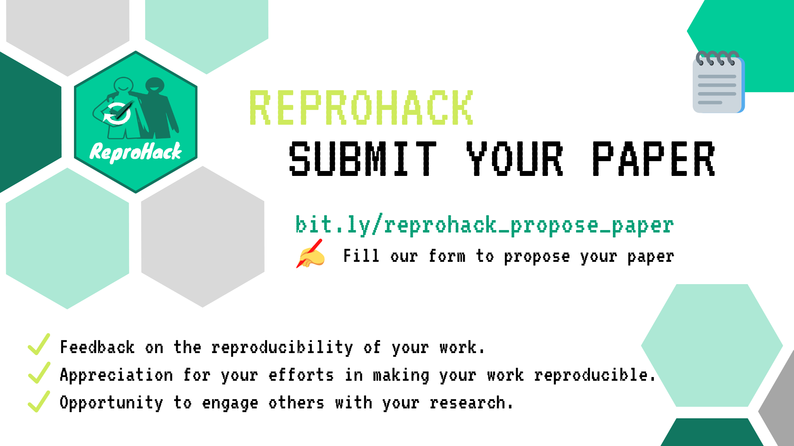

```{r setup, include=FALSE}
options(htmltools.dir.version = FALSE, echo = FALSE)
```

```{r xaringan-themer, include=FALSE, warning=FALSE}
library(xaringanthemer)
style_duo_accent(
  primary_color = "#1381B0",
  secondary_color = "#FF961C",
  inverse_header_color = "#FFFFFF",
    code_font_family = "Fira Code",
  code_font_url = "https://cdn.jsdelivr.net/gh/tonsky/FiraCode@2/distr/fira_code.css"
)

```


# Hola! Aquí Florencia

- Biologa / Investigadora postdoctoral INTA-CONICET

- ¡Me encanta enseñar!

- Fanática de las clases de actuación y las actividades al aire libre

- Web [florencia.netlify.app](florencia.netlify.app)

- Twitter [@cantoflor87](twitter.com/cantoflor_87)

---

class: center, middle

### ¿Cómo se me ocurrió dar esta charla?


---

background-image: url("images/repro.png")
background-position: center
background-size: contain

---

# Anna Krystalli en UseR! 2020

[Video](https://www.youtube.com/watch?v=KHMW8fV2NXo) - [Filminas](https://annakrystalli.me/talks/user2020.html#1)


```{r echo=FALSE, out.height=400, out.width=600}

```


---

```{r echo=FALSE}

```

---

```{r echo=FALSE}

```


---

# LatinR 2020

Conferencia Latinoamericana sobre Uso de R en Investigación + Desarrollo

7 al 9 de octubre 2020 - Virtual

[latin-r.com](latin-r.com)

```{r echo=FALSE, out.height=200, out.width=200}

```


---
class: inverse, center, middle

# Empecemos

---

# ¿Qué es la reproducibilidad?

> Los autores proporcionan todos los datos necesarios y el código para ejecutar el análisis nuevamente y recrear los resultados. 


--


> Reproducibilidad computacional: cuando se proporciona información detallada sobre código, software, hardware y detalles de implementación.


.footnote[Claerbout-Karrenbach(1992) - Reproducibility]

---

# Ventajas de la reproducibilidad

1. Genera un historial de tu trabajo
 
 * datos
 * herramientas 
 * métodos
 * código
 * documentación 

2. Más fácil que recibir colaboraciones

3. Publish validated research and avoid misinformation

4. Write your papers, thesis and reports efficiently

5. Get credits for your work fairly

6. Ensure continuity of your work


---

# ¿A quién no le paso?

--

**Quiero correr mi código en otra computadora o compartirlo**

--

PROBLEMAS:

 * Rutas de archivos 
 
 * Problemas con las versiones del software o formatos de archivos

--

**Quiero correr mi código luego de cierto tiempo**

--

PROBLEMAS:

 * Actualicé los paquetes y el softwares
 
 * Cambios en las extensiones de los archivos, que pueden volverse ilegibles (por ejemplo .xls y .xlsx)

---

class: center, middle, inverse


# Compartiendo mi código

---

class: center, middle

# Entornos computacionales


---

## Hay varias formas de capturar entornos computacionales.

* Sistemas de administración de paquetes (packrat - renv)

* Binder

* Máquinas virtuales 

* Contenedores

---

# Binder

Una versión de un proyecto dentro de un entorno computacional reproducible con la cual se puede compartir e interactuar a través de un navegador web.


```{r echo = FALSE}
knitr::include_graphics("images/binderlogo.png")
```


---

.pull-left[
## Beneficios

- Es relatiamente facil de usar

- Podes acceder a la información con solo un click

- Es gratuito
]
.pull-right[
## Limitaciones

- Potencia computacional

- Seguridad/privacidad (si usan mybinder.org)

- Also no FTP for connecting to some data.
]

---

# ¿Qué es un BinderHub?


```{r echo = FALSE}
knitr::include_graphics("images/siberia.jpg")
```


---

# mybinder.org 

Un BinderHub público y gratuito. Debido a que es público, no debe usarlo si su proyecto requiere información personal o confidencial (como contraseñas).

```{r echo=FALSE}
knitr::include_graphics("images/mybinder.png")
```


---

# "Binderizando" tu proyecto 🌀

Crear una versión Binderizada de un proyecto implica tres pasos clave que se explicarán en esta sección:

--
1. Especificar el entorno computacional. (**intall.R y runtime.txt** )

--

2. Subir los archivos del proyecto en algún lugar disponible al público (**GitHub o GitLab**)

--

3. Binderizar el proyecto (**mybinder.org**)


---

# 1. Especificar el entorno computacional

> runtime.txt

Especifica la version de R para que use Binder.

Para esto debes encontrar la fecha en que esta version fue capturada en MRAN e incluirla en el archivo como
`r-<YYYY>-<MM>-<DD>`

> install.R o DESCRIPTION (R/RStudio)

Este archivo debe contener una lista de todos los paquetes a ser instalados

`install.packages("tibble")`


---

# ¿Qué es MRAN? 📷


Desde el 17 de septiembre de 2014, Microsoft toma una instantánea diaria 📸 de todo el repositorio de CRAN y la almacena en [MRAN](https://mran.microsoft.com/documents/rro/reproducibility#reproducibility). 

Estas instantáneas han estado disponibles para la comunidad R desde entonces.

Paquete `checkpoint` me permite recuperar las versiones en el repositorio de CRAN para un determinado día.

---

# 2. Sube tu código a GitHub


---

# 3. Binderiza tu proyecto 🌀

a. Dirígete a https://mybinder.org

b. Pegue la URL del repositorio de GitHub del proyecto
`https://github.com/<your-username>/<your-repository>`

c. Finalmente, haz clic en el botón de LAUNCH. 
Esto le pedirá a mybinder.org que cree el entorno necesario para ejecutar el proyecto, tenga en cuenta que esto puede llevar varios minutos.

---

# ¡Paciencia! Esto lleva un rato ⏳


---

# Abrir tu proyecto con RStudio IDE


Cambia el link 

`https://mybinder.org/v2/gh/<usuario>/<repositorio>/<rama>?urlpath?rstudio`

Ejemplo de mi app: https://mybinder.org/v2/gh/flor14/test_shiny/master?urlpath=shiny/test/

---

class: center, middle, inverse

# 🌀 Binderiza tu Shiny App 🌀

---

# Los pasos 1 y 2 son los mismos

1. Subí tu app a una carpeta en tu repo de GitHub

2. Especifica el entorno computacional


---

# 3. Agrega el archivo `index.pynb`

Lo descargas desde [acá]()

---

# 4. Binderiza tu proyecto 🌀

a. Dirígete a https://mybinder.org

b. Pegue la URL del repositorio de GitHub del proyecto
`https://github.com/<your-username>/<your-repository>`

c. Finalmente, haz clic en el botón de LAUNCH. 


¡Recorda que lleva un rato este paso! ⏳


---

# ¡Listo!


Tenes que llamar la app usando este link si tenes tu datos en github

`https://mybinder.org/v2/gh/<usuario>/<repositorio>/<rama>?urlpath=shiny/<carpeta>/`

Ejemplo de mi app: https://mybinder.org/v2/gh/flor14/test_shiny/master?urlpath=shiny/test/

---


# Links

* [Proyectos en R - R4DS](https://r4ds.had.co.nz/workflow-projects.html#rstudio-projects)

* [The Turing Way Book](https://the-turing-way.netlify.app/)

* [Reproducible Environments - RStudio](https://environments.rstudio.com/)

* [Time_Travel_R (Webinar) - Sean Lopp](https://rstudio.com/resources/webinars/time-travel-r/)

* [renv: Project Environments with R - RStudio blog](https://blog.rstudio.com/2019/11/06/renv-project-environments-for-r/)

* [Rrtools]()

* [Reproducible Research with R - ROpensci Call](https://ropensci.org/commcalls/2019-07-30/)

* [Holepunch]()

---

class: center, middle

# Thanks!

Slides created via the R package [**xaringan**](https://github.com/yihui/xaringan).

The chakra comes from [remark.js](https://remarkjs.com), [**knitr**](http://yihui.name/knitr), and [R Markdown](https://rmarkdown.rstudio.com).
